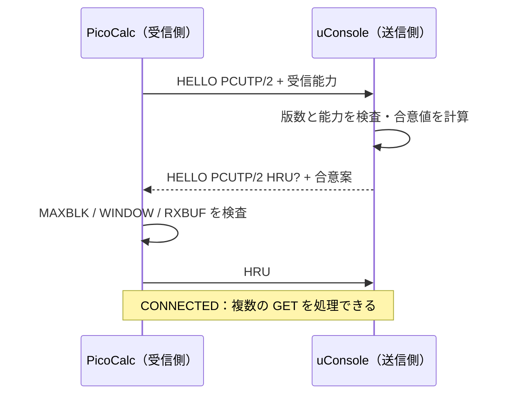
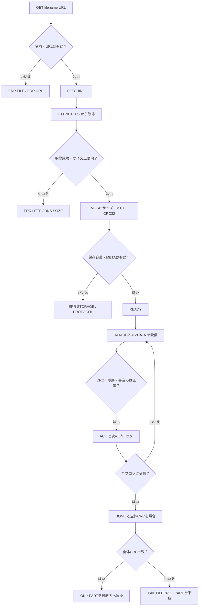
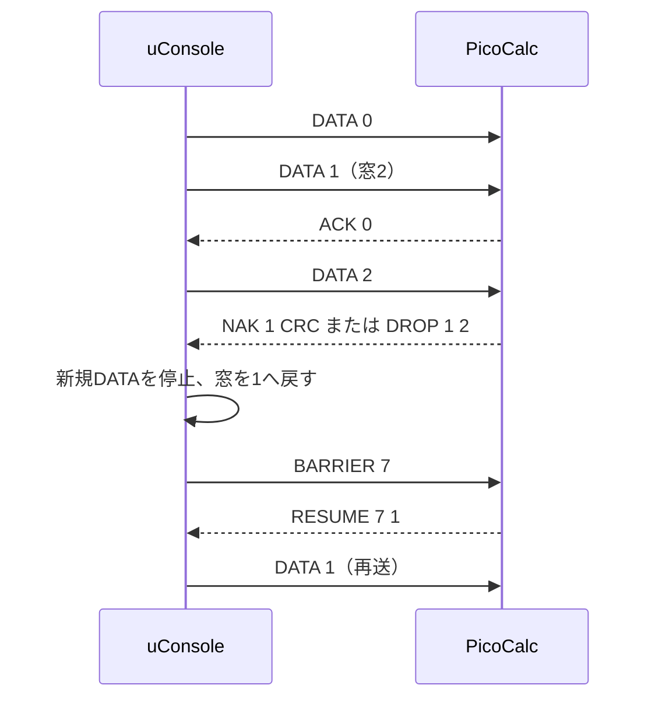
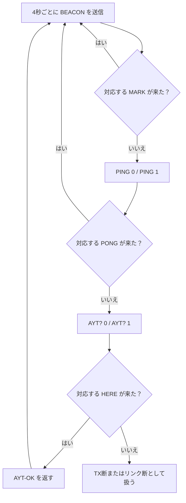

# PCUTP v0.2 — UART File Transfer Protocol

PCUTP は PicoCalc と uConsole を UART で結び、uConsole が HTTP/HTTPS から取得したファイルを PicoCalc の SD カードへ渡すためのプロトコルである。

```text
Internet -> HTTP/HTTPS -> uConsole (gateway / sender) -> UART -> PicoCalc (receiver)
```

この文書は `pcutp-v2` の現行実装を規範とする。パッケージ版は 2.1.0、ワイヤ上の版は **`PCUTP/2`** である。v0.1 の凍結仕様は [PCUTP-0.1.md](PCUTP-0.1.md) に残す。

## 1. 回線とフレーミング

- UART は **115200 baud、8N1、フロー制御なし**でセッション中固定する。
- 制御語は ASCII 行であり、LF (`0x0A`) で終端する。
- `DATA` と `ZDATA` の直後には、ヘッダが示す正確なバイト数の RAW ペイロードが続く。RAW 部分を改行区切りとして扱ってはならない。
- 標準の最大展開ブロック長は 4096 bytes、最大ファイル長は 16 MiB である。

115200 は Flipper USB-UART ブリッジを含む実機で 4096-byte の連続ブロックを安定して運べた既定値である。高速な短いプローブだけを根拠に速度を上げることはしない。

```text
DATA <sequence> <length> <crc32> LF
<length bytes of raw data>

ZDATA <sequence> <compressed-length> <raw-length> <raw-crc32> LF
<compressed-length bytes of an independent LZ4 block>
```

### DATA パケットフレーム

```text
ASCII 制御ヘッダ（LFまで）                RAW ペイロード（宣言された長さだけ）
┌──────┬────┬─────┬────┬────────┬────┬────────┬────┐ ┌─────────────────────┐
│ DATA │ SP │ seq │ SP │ length │ SP │ CRC-32 │ LF │ │ 0x00 ～ 0xFF        │
└──────┴────┴─────┴────┴────────┴────┴────────┴────┘ └─────────────────────┘
  4 B    1 B  可変  1 B    可変    1 B    8 B    1 B          length B

例: DATA 12 4096 4A91F33C\n <続けて4096 bytes>
```

ヘッダを LF まで読んだら、受信側は `length` bytes をそのまま読む。その間の `0x0A`、`0x00`、`0xFF` は区切りや制御語ではなく、すべてファイル本体である。

CRC は CRC-32/ISO-HDLC を使用し、ワイヤ上では大文字8桁の16進数で表す。

## 2. セッション確立と能力交渉

PicoCalc が起呼側、uConsole が応答側である。最初の `HELLO` は受信能力の提示、応答の `HELLO ... HRU?` は合意案、最後の `HRU` は受諾である。

```text
PicoCalc -> HELLO PCUTP/2 FLOW=1 MAXBLK=4096 WINDOW=2 RXBUF=16384 LZ4=1
uConsole -> HELLO PCUTP/2 HRU? BAUD=115200 MAXBLK=4096 FLOW=1 WINDOW=2 LZ4=1
PicoCalc -> HRU
```

### ハンドシェイク図



最初の応答を取りこぼした PicoCalc は `HELLO?` を最大9回追加で送れる。uConsole は同じ合意案を `OHRU PCUTP/2 ...` として返す。`PCUTP/2` 以外は `ERR VERSION` で拒否する。接続中に新しい `HELLO` を受けた場合も、ピアの再起動としてこの手順をやり直す。

能力は `KEY=value` 形式で、未認識の能力は無視する。重複・値のない・非10進の既知能力は `ERR PROTOCOL` の対象となる。

| 能力 | 意味 |
|---|---|
| `MAXBLK` | 受信側が受けられる展開後ブロック長の上限 |
| `FLOW=1` | 窓、累積 ACK、復旧バリアを使える |
| `WINDOW` | 受信側が許可する最大未確認フレーム数 |
| `RXBUF` | UART 受信バッファの bytes |
| `LZ4=1` | 独立 LZ4 ブロックを受けられる |

`MAXBLK` は双方の上限の小さい方を採る。`WINDOW` は双方の上限に加え、`floor(RXBUF / (MAXBLK + 64))` を超えない。`FLOW=1` が合意されない場合は互換モードとして stop-and-wait（窓1、非圧縮）で転送する。

## 3. Identity Discovery（仕様拡張）

`WHO?` / `IAM` は、確立済みセッション上で相手が名乗るための任意拡張である。これは識別情報の発見であり、本人性の認証ではない。

現行実装はこの拡張をまだ送受信しない。互換性を保つため、実装する場合は能力交渉で **`IDENTITY=1`** が双方から提示・合意されたときだけ `WHO?` と `IAM` を使う。能力未合意のピアへ送ることはプロトコルエラーを招く。

```text
WHO? <token>
IAM <token> TYPE=<type> [NAME=<name>] [ROLE=<role>] [ID=<id>] [VER=<version>] [FW=<firmware>]
```

`token` は ASCII 10進整数で、問い合わせと応答で一致しなければならない。問い合わせ側は現在保留している token と一致しない `IAM` を無視する。これにより、遅延した応答を新しい問い合わせへの返答と取り違えない。

`TYPE` だけが必須である。属性の順序に意味はなく、未知の属性は無視する。属性名と値は空白・LF・`=` を含まない ASCII 安全文字列とする。

| 属性 | 意味 | 例 |
|---|---|---|
| `TYPE` | 機械的な種別 | `COMPUTER`, `MCU`, `BRIDGE`, `UART_DEVICE`, `SENSOR`, `MODEM`, `UNKNOWN` |
| `NAME` | 人が読む任意の名称 | `FLIPPER`, `GPS`, `UCONSOLE` |
| `ROLE` | このセッションでの役割 | `CLIENT`, `SERVER`, `GATEWAY`, `BRIDGE`, `SOURCE`, `SINK`, `PEER` |
| `ID` | 非秘密の個体識別子 | `FZ01` |
| `VER` | PCUTP または製品の版 | `2.1` |
| `FW` | ファームウェア版 | `0.105.0` |

```text
WHO? 0
IAM 0 TYPE=BRIDGE NAME=FLIPPER ROLE=BRIDGE ID=FZ01 VER=2.1

WHO? 1
IAM 1 TYPE=UART_DEVICE NAME=GPS ROLE=SOURCE
```

`IAM` は自己申告である。`IAM ... NAME=FLIPPER` は「Flipper と名乗っている」ことだけを表す。信頼判定が必要な用途は、将来の nonce と署名を用いる認証サブプロトコルで扱う。

## 4. ファイル取得と転送

```text
PicoCalc -> GET <filename> <url>
uConsole -> FETCHING
              [HTTP/HTTPS fetch]
uConsole -> META <filename> <size> <blocksize> <blocks> <crc32>
PicoCalc -> READY
uConsole -> DATA / ZDATA ...
PicoCalc -> ACK / NAK / DROP ...
uConsole -> DONE <crc32>
PicoCalc -> OK <crc32> | FAIL FILECRC <actual-crc32>
```

### 転送フローチャート



ファイル名は 64 文字以下の `A-Z a-z 0-9 . _ -` だけを許可する。パス成分は除去され、URL は `http` と `https` だけを許可する。リダイレクト数、HTTP 時間、サイズにも上限を設ける。

`FETCHING` は GET の受理後、HTTP 取得前に送る。「相手は生きているが、取得中は UART が無音になる」という宣言である。受信側はこれを受けると `META` の待機を `FETCH_TIMEOUT`（45秒）まで広げる。`FETCHING` を送らない旧実装とも、直後に `META` を受けることで互換となる。

受信側は `META` を検証し、空き容量がなければ `ERR STORAGE` を返す。受信内容は `<filename>.PART` に保存し、最終 CRC が一致した場合だけ本来の名前へ原子的に置換する。進行中の状態は別ファイル `<filename>.PCUTP` に保存するため、RAW データへ制御情報を混在させない。

### 4.1 フロー制御、再送、圧縮

FLOW モードでは `ACK n` は 0 から n までの連続ブロックを保存した累積確認である。送信側は窓1から始め、連続した正常 ACK が8回あれば交渉済みの最大窓（現行最大2）まで広げる。NAK、DROP、タイムアウト、RST では窓1へ戻す。

CRC 不一致は `NAK <expected> CRC`、順序ずれは `DROP <expected> <received>` を返す。再送前に送信側は `BARRIER <id>` を送り、受信側が `RESUME <id> <next-seq>` を返して古い飛行中データを排出したことを確認する。`id` は増加する token で、遅延した応答を区別する。

```text
uConsole -> BARRIER 7
PicoCalc -> RESUME 7 1
uConsole -> DATA 1 ...
```

### FLOW=1 の送信窓と復旧



連続した順序ずれが3回に達した受信側は `RST 0` を送り、送信側は全ファイルを先頭から再送する。送信側が無応答を調べ尽くした場合は `RST 0 <token>` を送り、受信側は部分ファイルだけを捨てて `RST-ACK <token> 0` を返す。どちらもセッションを作り直さない転送ローカルな回復であり、完全再開は最大2回である。

`ZDATA` は独立 LZ4 ブロックを運ぶ。展開後の長さと CRC を通常の DATA と同じように検証する。圧縮が不利なブロックは常に通常の `DATA` に戻してよい。

### 4.2 無応答時の確認

DATA の ACK が遅いとき、送信側は RAW 受信の途中に制御語を混ぜない。ACK タイムアウト後もガード時間を置き、それから `AYT? <token>` / `HERE <token> <next-seq>` で受信位置を確認する。`HERE` の後も必ず `BARRIER` / `RESUME` を行ってから転送を再開する。

`RMB? <bit>` / `RMB <bit> <state> ...` / `RMB-ACK <bit>` は、アイドル時または制御行待機中の受信状態照会である。`RMB-ACK` の欠落は転送やセッションをリセットしない。

## 5. リンクの維持と方向診断

UART は片方向だけが断線しうる。PCUTP はアイドル中、両端が4秒ごとに方向付きビーコンを出し、逆方向の `MARK` で到達を確認する。

```text
uConsole -> BEACON U 0
PicoCalc -> MARK P U 0

PicoCalc -> BEACON P 0
uConsole -> MARK U P 0
```

### アイドル時の診断フロー



ビットは `0` と `1` を交互に使う。`MARK` が返らなければ `PING <bit>` / `PONG <bit>`、さらに `AYT?` / `HERE` へ段階的に進む。token が一致する応答だけを生存確認として受け入れる。これにより相手のビーコンが届くのに自分の MARK が戻らない場合、送信方向の異常として切り分けられる。

| 定数 | 現行値 | 意味 |
|---|---:|---|
| `BEACON_INTERVAL` | 4秒 | アイドル中の双方向ビーコン間隔 |
| `KEEPALIVE_INTERVAL` | 5秒 | PING または段階診断を開始する無音時間 |
| `KEEPALIVE_RETRIES` | 3 | 許容する未応答プローブ数 |
| `KEEPALIVE_TIMEOUT` | 20秒 | uConsole 側のリンク喪失目安 |
| `FETCH_TIMEOUT` | 45秒 | `FETCHING` 後の META 待機時間 |
| `HTTP_TIMEOUT` | 30秒 | uConsole 側の HTTP 取得上限 |

`FETCH_TIMEOUT > HTTP_TIMEOUT` を保つ必要がある。PicoCalc BASIC 実装のアイドル待機値は 30秒で、`FETCHING` 中は同じく45秒へ広げる。転送中は DATA の RAW 境界を守るため、上記のアイドル診断ではなく §4.2 の `AYT?` 手順を使う。

## 6. 正常切断

`CLOSE` は「この方向からはもう送らない」、`BYE` はその確認である。双方が独立に閉じられるため、飛行中のファイルを受け切ってから終了できる。

```text
A -> CLOSE
B -> BYE
B -> CLOSE
A -> BYE
     [双方2秒間 linger。重複 CLOSE には BYE を返す]
```

`CLOSE` は3秒ごとに最大3回まで再送する。最後の `BYE` の後、両端は2秒間 `LINGER` し、取りこぼされた `BYE` により再送された `CLOSE` へ再び `BYE` を返す。この静穏期間が、前セッションの制御行を次セッションの先頭行として誤解することを防ぐ。

## 7. エラーと実装上の境界

主要なエラーは `ERR VERSION`、`ERR URL`、`ERR HTTP [status]`、`ERR DNS`、`ERR SIZE`、`ERR STORAGE`、`ERR FILE`、`ERR WRITE`、`ERR TIMEOUT`、`ERR RETRY`、`ERR PROTOCOL` である。`LINKLOST` は相手へ送らないローカルな判定である。

PCUTP は UART の先に TCP/IP を実装しない。uConsole が DNS、TLS、HTTP を担当し、PicoCalc は UART フレーミング、検証、保存を担当する。音による制御語の可聴化は補助機能であり、プロトコルの意味やタイミングを変えてはならない。

## 8. 性能記録

2026-09-07 の PicoCalc + Flipper UART ブリッジ実測では、無圧縮1 MiB の転送が窓1の124.84秒から FLOW 窓2の94.01秒になり、10.89 KiB/s（115200 8N1 のペイロード理論上限 11.25 KiB/s の約96.8%）に達した。

32 KiB では MTU 1024、128 KiB では 2048、1 MiB では4096が測定条件で最良だった。圧縮しにくいデータは `DATA` へ退避し、反復データでは LZ4 により展開後の見かけの転送速度が線速を上回り得る。これは物理回線速度が上がったことを意味しない。

生の測定 JSON はリポジトリ直下の `benchmarks/2026-09-07/` に保存する。測定は META 送信から最終 OK までを対象とし、HTTP の変動、接続音、切断待機を含めない。

## 9. 全制御語

```text
HELLO HELLO? OHRU HRU
GET FETCHING META READY
DATA ZDATA ACK NAK DONE OK FAIL
DROP BARRIER RESUME RST RST-ACK
PING PONG AYT? HERE AYT-OK
BEACON MARK
RMB? RMB RMB-ACK
CLOSE BYE ERR
```

`WHO?` と `IAM` は §3 の `IDENTITY=1` 拡張を実装したピア間で追加される。
